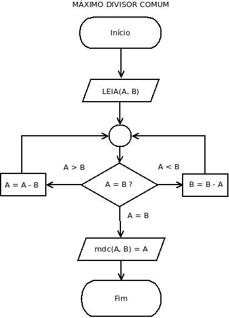
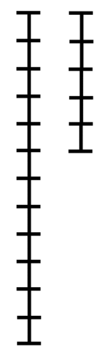
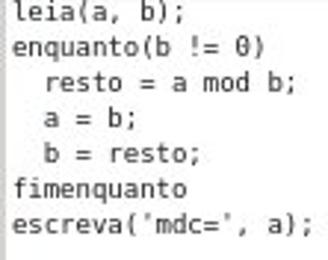
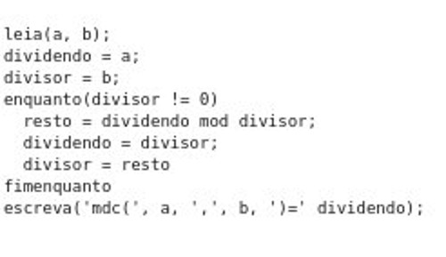

# PUC-PR - Algoritmos e Programação

Turma: Engenharia de Alimentos - 18/05/2015

---

# Link dos Slides

[http://tinyurl.com/kovvez4](http://tinyurl.com/kovvez4)

---

# Número Primo

Um número primo possui apenas 2 divisores: 1 e ele mesmo

* Conte o número de divisores de 1 até N
* Se houverem apenas 2 divisores, então N é primo
* 0 não é primo
* 1 não é primo

---

# Máximo Divisor Comum

* Algoritmo de Euclides (300 a.C)

* Um dos primeiros algoritmos conhecidos!!

---

# Máximo Divisor Comum

---

# Máximo Divisor Comum

---

# Máximo Divisor Comum

---

# Máximo Divisor Comum

---

# Sequência de Fibonacci

F = 0, 1, 1, 2, 3, 5, 8, 13, 21, 34, 55, 89

F(0) = 0

F(1) = 1

F(N) = F(N - 1) + F(N - 2)

---

# Fibonacci e Número de Ouro

<iframe width="560" height="315" src="https://www.youtube.com/embed/kkGeOWYOFoA" frameborder="0" allowfullscreen></iframe>

---
# Fatorial

* Fatorial de 0 -> 0! = 1
* Fatorial de 1 -> 1! = 1
* Fatorial de N -> N! = N * Fatorial(N - 1)

---

# Número de Euler

E = 1/0! + 1 / 1! + 1 / 2! + 1 / 3! +  ... + 1 / N!

Valor aproximado: 2,71828182845904523530287

[Número de Euler](http://pt.wikipedia.org/wiki/N%C3%BAmero_de_Euler)

[Implementação do Número de Euler](https://github.com/everaldo/linguagem_c/blob/master/exercicios/eng_mecanica/lista3_comandos_repeticao/exe2_numero_euler_n_iteracoes.c)

---

# Referências e Links

* [Fatorial com long long](https://github.com/everaldo/linguagem_c/blob/fe20e422b295550082f94dd61721e283ce5fdc7b/exercicios/automacao_industrial/lista1/exe2_fatorial.c)
* [Fatorial](https://github.com/everaldo/linguagem_c/blob/fe20e422b295550082f94dd61721e283ce5fdc7b/trabalho/engenharia_mecanica/gabarito/parte-vii/01-fatorial.c)
* [Sequência de Fibonacci](http://pt.wikipedia.org/wiki/Sequ%C3%AAncia_de_Fibonacci)
* [Soma dos primeiros N termos da Sequência de Fibonacci](https://github.com/everaldo/linguagem_c/blob/fe20e422b295550082f94dd61721e283ce5fdc7b/exercicios/eng_mecanica/lista3_comandos_repeticao/exe7_serie_fibonacci.c)
* [Número de Euler](http://pt.wikipedia.org/wiki/N%C3%BAmero_de_Euler)
* [Implementação do Número de Euler](https://github.com/everaldo/linguagem_c/blob/master/exercicios/eng_mecanica/lista3_comandos_repeticao/exe2_numero_euler_n_iteracoes.c)
