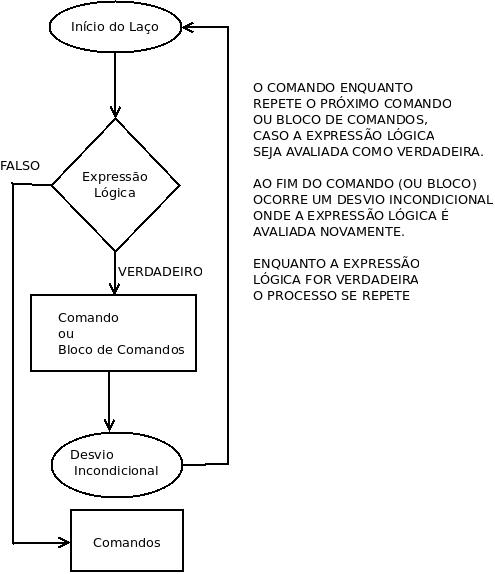
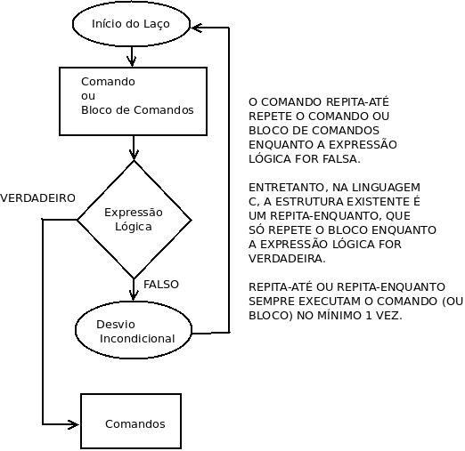
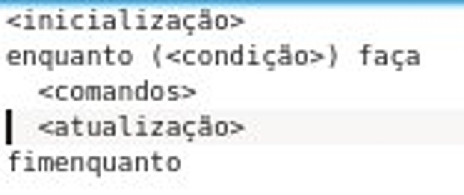
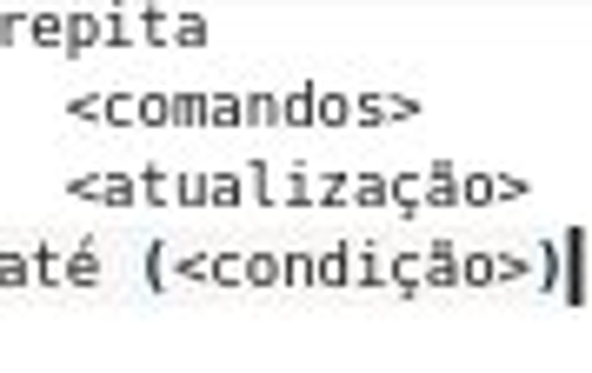

# Algoritmos e Programação

Turma: Engenharia Civil
Aula: 20/05/2015

Comandos de Repetição

Slides disponíveis em:

[http://tinyurl.com/slides20maio](http://tinyurl.com/slides20maio)

---

# Lembretes

* Confiram material de estudo no Eureka;

* Os comandos de repetição habilitam os alunos a resolverem os exercícios da Lista III.

---

# Comandos de Repetição

Na programação estruturada, além dos comandos sequenciais
e de seleção temos os comandos de repetição

----

# Tipos de Problemas

Os comandos de repetição são úteis na resolução dos seguintes tipos de problemas:

* Problemas que envolvem a repetição dos mesmos comandos (podendo haver pequenas variações);

* Problemas de contagem;

----

# Tipos de Problemas

* Problemas de cálculo numérico (algoritmos que realizam convergência ou aproximação, a cada passo);

* Problemas com Coleções de Valores (Vetores e Matrizes).

---

# Alguns Algoritmos que serão estudados no curso:

* Identificar se um número é primo;

* Cálculo do Máximo Divisor Comum (M.D.C);

* Cálculo do Fatorial de um número;

---

# Alguns Algoritmos que serão estudados no curso:

* Cálculo de Séries Infinitas (Séries de Taylor);

* Contagem em intervalos numéricos;

* Ler, Escrever e Manipular Coleções de Valores.

---

 Comando de Repetição ENQUANTO

---

Comando de Repetição REPITA-ATÉ

---

# Componentes de um Comando de Repetição

Os comandos (ou estruturas) de repetição possuem 3 componentes (informais):

* Inicialização,  Condição e  Atualização.

----

# Inicialização

A inicialização ajusta os valores das variáveis na primeira iteração (**uma repetição é chamada
de iteração**).

----

# Inicialização

Se não houver inicialização, restam duas hipóteses:

* o comando de repetição sempre executará no mínimo uma vez (ou infinitamente, se também não houver atualização);
* o comando de repetição nunca executará.

----

# Inicialização

Logo, definimos a inicialização como o processo que decide se um comando de repetição será executado na primeira
iteração.

Observando que, no comando de repetição **repita-até**, os comandos sempre serão executados uma primeira vez,
mesmo se não houver inicialização.

----

# Condição

A condição é uma expressão que será avaliada pelo seu valor lógico (**VERDADEIRO** ou **FALSO**).

* No comando *enquanto*, o bloco é executado enquanto a expressão for avaliada como verdadeira;
* Se na primeira iteração, a condiçaõ é avaliada como **falsa**, o bloco nunca é executado.

----

# Condição

* No comando *repita-até*, o bloco de comandos é executado enquanto a expressão for avaliada como falsa;
* O bloco (ou comando) é sempre executado uma vez;
* Se na primeira iteração, a condiçaõ é avaliada como **verdadeira**, o bloco é executado somente uma vez.

----

# Observação

O comando repita-até só é utilizado em fluxogramas e não está presente na linguagem C.
Embora esteja presente em outras linguagens, como Ruby.

Na linguagem C há o comando repita-enquanto (**do-while**), que repete o bloco enquanto
a condição for verdadeira (o contrário do **repita-até**)

----

# Condição

Portanto, a **condição** é a estrutura dos laços de repetições que define se os comandos
serão executados novamente (e executados pela primeira vez, quando o comando for um **enquanto**)

----

# Atualização

* A inicialização define se um comando de repetição será executado pela primeira vez (**somente se o comando for enquanto**);
* A condição decide se um comando de repetição será executado ou continuará a ser executado (**no caso do comando repita-até**);

A atualização é a estrutura de um comando de repetição que permite que ele não execute indefinidamente (**loop infinito**);

----

# Atualização

Se não houver atualização num comando de repetição, então ele nunca deixará de executar (**a não ser que seja usado o comando abandone**, de quebra de fluxo)

* A atualização é uma estrutura informal. É o processo de atribuição de novos valores às variáveis que compõem a expressão lógica que forma a condição.

----

# Resumindo

* A inicialização e a atualização podem ser compostas por comandos de atribuição e de leitura (**leia**);
* A condição é uma expressão, avaliada pelo seu valor lógico (**verdadeiro** ou **falso**). 

----

# Representação genérica do comando enquanto

----

# Representação genérica do comando repita-até

----

# Comando de Repetição **Para**

* o comando enquanto repete de [0..n] vezes;
* o comando repita-até repete de [1..n] vezes.

Existe um terceiro comando de repetição chamado **para**,
que usualmente é utilizado para **contar** de [1..n]

----

# Comandos de Repetição

* Todos os comandos de repetição podem ser transformados num comando **enquanto**;
* Mas o **repita-até** é utilizado quando se quer executar no mínimo uma vez;
* E o **para** quando se quer contar (usualmente, de [1..n], mas pode ser de [n..1]
ou qualquer outra progressão aritmética).

---

# Comando de Repetição **Para**

Em pseudo-código, o formato do comando **para** é o seguinte:

para *<VARIAVEL CONTADORA\>* de *<VALOR INICIAL DA CONTAGEM\>* até *<VALOR FINAL DA CONTAGEM\>* [passo *<PROGRESSÃO DA CONTAGEM\>*] faça

----

# Comando de Repetição **Para**

Onde, **VARIAVEL CONTADORA** é uma variável inteira, que inicia com **VALOR INICIAL DA CONTAGEM** e é incrementada
com o valor da **PROGRESSÃO DA CONTAGEM** (que é opcional, se for omitido, conta-se de 1 em 1), enquanto seu valor
seja menor ou igual a **VALOR FINAL DA CONTAGEM**

----

# Exemplos

para i de 1 até 10 faça

  <comandos\>

fimpara

para i de 10 até 1 passo -1 faça

  <comandos\>

fimpara

----

# Exemplos

para i de 1 até 1000 passo 10 faça

  <comandos\>

fimpara

----

# Comando de Repetição **Para**

* Além de ser usado para contagens, o comando **para** traz explicitamente as três estruturas
de um comando de repetição: inicialização, condição e atualização.
* A condição sempre é menor ou igual OU maior ou igual (quando a contagem é decrescente),
em relação à variável contadora e o valor expresso por **até**.

----

# Exercícios

1. Escreva um algoritmo que leia um número entre 10 e 20, usando a estrutura **repita-até**
2. Escreva um algoritmo que leia um número entre 10 e 20, usando a estrutura **enquanto**
3. Escreva um algoritmo que imprima todos os números no intervalo de 1 a 100

----

# Exercícios

4\. Escreva um algoritmo que imprima todos os números no intervalo de 100 a 1

5\. Escreva um algoritmo que imprima todos os números pares no intervalo de 1 a 100, sem usar
o comando *se*
